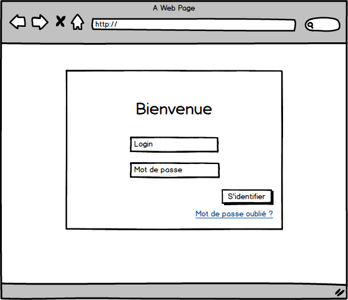

But
===
Produire le code client (interfaces et logique) correspondant aux users stories décrites ci-dessous. 

Travail
-------
Lors de la planification du lundi matin, le product owner vous a assigné les users stories suivantes pour lesquelles le web designer a fourni des maquettes :

**User story 1 :**
> En tant qu'utilisateur ayant les droits "administrateur", je peux m'identifier via une interface de login.

**User story 2 :**
> En tant qu'utilisateur ayant les droits "administrateur", je peux insérer une question / réponse dans la base de connaissances (FAQ) du produit via un formulaire prévu à cet effet. Une question / réponse est définie par :
> 1. Le libellé de la question ;
> 0. Le libellé de la réponse ;
> 0. La liste des tags associés.

**User story 3 :**
> En tant qu'utilisateur ayant les droits "administrateur", je peux lister toutes les questions / réponses de la base de connaissances.

**User story 4 :**
> En tant qu'utilisateur ayant les droits "administrateur", je peux filtrer les questions / réponses de la base de connaissances selon les critères suivants :
> 1. La question ;
> 0. Le ou les tags associés.

**User story 5 :**
> En tant qu'utilisateur, je peux rechercher la réponse à une question et afficher la liste des résultats correspondants. Note : cette fonctionnalité est accesssible sans avoir à s'identifier.

Attendus techniques
-------------------
Vous donnerez accès à `netheos` à votre projet hébergé sur github. Celui-ci devra être assemblé via Gulp ou Webpack.

Vous effectuerez les appels au serveur en simulant les retours de celui-ci comme s'il exposait une API REST.

Vous fournirez un fichier readme.md décrivant la procédure pour tester votre code.

Vous justifierez également vos choix en termes d'outils et d'implémentation.

Vous êtes libre d'utiliser AngularJS ou Angular 2.

N'hésitez pas à poser vos questions si certains points ne sont pas assez clairs.

Critères d'évaluation
-------------------
Votre code sera jugé selon les critères suivants :
- Elégance ;
- Performances ;
- Sécurité ;
- Robustesse.
